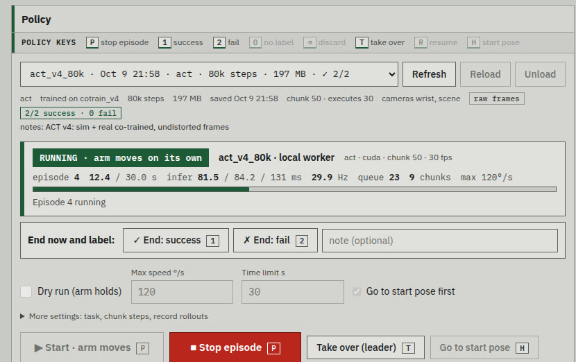

# Phone video in. Simulator in the middle. Real robot out.

A low-cost SO-101 arm learns to put a 30 mm cube into a cup. A 45-second phone video of the desk becomes a Gaussian splat. The splat becomes the background of an Isaac Sim scene calibrated to the real cameras. That scene produces thousands of randomized demonstrations, which are co-trained with 40 real ones. The resulting policy runs on a Jetson Orin Nano next to the arm. **Real → sim → real.**

| | |
|---|---|
| **88%** | sim success, 50 held-out scenes |
| **2 / 2** | first real-arm trials (co-trained) |
| **25%** | real-only baseline, 4 / 16 |
| **4,013 + 40** | sim + real demos behind the 88% policy |
| **40 ms** | policy inference on the Jetson |

<video src="videos/00_reel.mp4" poster="posters/00.jpg" controls muted loop playsinline preload="none" width="100%"></video>

*Highlight reel, about 45 s. Every clip below is one step of the pipeline.*

**Pipeline:** 1 Capture → 2 Gaussian splat → 3 Real-to-sim alignment → 4 Sim demos → 5 Recovery data → 6 Data audit → 7 Real demos → 8 Train & iterate → 9 Sim evaluation → 10 Real deployment

---

## 1. Capture the real workspace

One handheld phone pass around the desk, arm, cup and both robot cameras. No scanner, no markers. This video is the only input to the 3D reconstruction.

- iPhone HLG/BT.2020 HDR, tone-mapped to SDR (zscale + Hable) before any frame is used.
- Sharpest frame per time window is kept; structure-from-motion (COLMAP via pycolmap) recovers the camera poses.

**Input:** 45 s, 1080×1920, 60 fps · **Cost:** one minute of filming

<video src="videos/01_capture.mp4" poster="posters/01.jpg" controls muted loop playsinline preload="none" width="100%"></video>

*First 29 s of the walk-around at 2.5× speed.*

## 2. Reconstruct it as a Gaussian splat

The frames and poses train a 3D Gaussian splat with gsplat. The volume over the desk and around the robot base is cropped out. The rest is converted to a USD ParticleField, so Isaac Sim's RTX renderer draws the real room around the simulated desk top, robot, cube and cup.

- Everything the policy touches is a physics object, so it can move and be randomized. The splat supplies everything else the cameras see.
- The splat is aligned in the robot frame and colour-matched to the real cameras (step 3).

**Gaussians:** 346,881 (SH degree 3) · **Stack:** gsplat 1.6 → omni.kit.converter.gsplat → Isaac Sim 6.1

<video src="videos/02_splat.mp4" poster="posters/02.jpg" controls muted loop playsinline preload="none" width="100%"></video>

*120° fly-around of the splat, rendered on CPU. The desk top is the sim's texture, and the arm is a sim object, so neither is in this render.*

## 3. Align the simulator with the real rig

A policy only transfers if the simulated cameras see what the real ones see. Every camera and joint was measured and the sim corrected to match.

- **Lens calibration** with a ChArUco board shown on a phone screen (no printer). The wrist camera has a 60° field of view and strong barrel distortion, against 87° in the stock sim asset. Real frames are undistorted before the policy sees them.
- **Overhead camera pose** solved with the robot itself as the target: arm poses + forward kinematics + silhouettes. It sits about 1.4 m above the desk, not the assumed 0.85 m.
- **Joint zero offsets** (up to 4.5°) found by replaying recorded real episodes in sim.
- **Splat pose** (position, rotation, scale) and a per-channel colour gain fitted against the real overhead frame. **Wrist-camera mount** refitted, since the stock mount didn't match this rig.

<video src="videos/03_real2sim.mp4" poster="posters/03.jpg" controls muted loop playsinline preload="none" width="100%"></video>

*Wipe between the real camera frame and the sim render from the same calibrated camera.*

## 4. Generate demonstrations in simulation

A scripted expert solves the task in Isaac Lab with full knowledge of the state, while the cameras record what a policy would see.

- **Expert:** a state machine (pre-grasp, descend, grasp, rise, transport, release) that advances when the arm settles, not on fixed timers. That change, together with doubling to 400 demos, took ACT from 28% to 62%.
- **Domain randomization** each episode: cube and cup pose over the real desk, lighting, desk texture, splat colour, camera pose jitter, friction.
- **DART noise:** the executed actions are perturbed, but the recorded labels are the expert's clean corrections. Demos then contain small recoveries for free.

**v4 batch:** 1,251 splat-background expert demos · **Compute:** 6 cloud A6000s in parallel (Isaac RTX rendering needs RT cores; about 20 env-steps/s per GPU)

<video src="videos/04_sim_demos.mp4" poster="posters/04.jpg" controls muted loop playsinline preload="none" width="100%"></video>

*Expert demos (overhead + wrist camera), then a grid of randomized resets.*

## 5. Teach recovery with takeovers

Behaviour cloning fails by drifting into states the expert never visits: a missed grasp, a dropped cube, hovering. To cover those states, a trained policy drives, and the expert takes over when the policy fails (DAgger-style).

- Takeover triggers: hovering without progress, dropped cube, empty grasp, time-outs.
- Only the expert's recovery is a training label; the policy's own mistakes set up the situation.

**v4 batch:** 762 takeover episodes · **Effect:** in the first sim build, +300 takeovers took ACT from 62% to 84%

<video src="videos/05_recovery.mp4" poster="posters/05.jpg" controls muted loop playsinline preload="none" width="100%"></video>

*Blue bar: the policy is driving. Orange bar: the expert took over, with the reason.*

## 6. Audit the data before training on it

A visual review of generated scenes showed cups spawning partly or fully off the real desk. The sim's physics desk is larger than the real one, so those demos taught behaviour that can't exist in the real world.

- Fix: sample spawns inside the measured desk polygon, with the cup at least 5.5 cm and the cube at least 3 cm from the edge. All evaluations since use the fixed sampler.
- A cleaned training mix (v4b) drops every episode with an invalid spawn instead of keeping it as noise.

**Dropped:** 1,509 of 4,013 sim episodes (37.6%) · **Other catches:** first frame after reset showed the previous episode's render; a dataset-merge bug wrote bad file indices; a mixed-precision flag that silently did nothing

<video src="videos/06_data_audit.mp4" poster="posters/06.jpg" controls muted loop playsinline preload="none" width="100%"></video>

*Random resets before and after the spawn fix.*

## 7. Collect real demonstrations

40 demos teleoperated with a leader arm that the follower mirrors. They are recorded on the Jetson through a web console built for this project, in LeRobot v3 format with wrist and overhead cameras.

- Placements spread across the whole desk, after an early lesson: the first 10 demos all had the cube on the left, and the real-only policy learned exactly that bias.

**Size:** 40 episodes, 14,704 frames (8.2 min) at 30 fps · **Cameras:** wrist (Innomaker U20CAM) + overhead (Astra Pro), 640×480

<video src="videos/07_real_demos.mp4" poster="posters/07.jpg" controls muted loop playsinline preload="none" width="100%"></video>

*Nine of the 40 real demos (overhead) and three wrist views.*

## 8. Co-train and iterate

ACT (Action Chunking Transformer: ResNet-18 + CVAE, predicts 50 future actions and executes 30) is co-trained on sim and real data. Real episodes are upweighted so they make up about a quarter of all frames.

- Each data change was measured in sim before moving on (video: same scene, four policy generations).
- Also trained and compared: SmolVLA (a 450M vision-language-action model) and NVIDIA GR00T N1.7 (3B), fine-tuned on H100s.

**v4 mix:** 4,013 sim + 40 real (×19), 1.10M frames, 25% real · **v4b mix:** 2,504 cleaned sim + 40 real (×11), 666k frames · **Training:** 80k steps, bf16, one H100 (0.081 s/step, 2.1× an A6000)

<video src="videos/08_iterations.mp4" poster="posters/08.jpg" controls muted loop playsinline preload="none" width="100%"></video>

*Four generations of the policy on the same sim seed. Success rates are over 50 episodes.*

## 9. Evaluate in simulation

Every checkpoint runs 50 held-out randomized scenes. Each episode is scored as success, time-out or tipped cup. The failures are then sorted by cause, because the cause picks the next data fix.

- **ACT v4 80k:** 44 / 50 = 88%
- **By cup distance:** 15–20 cm 11/12 · 20–25 cm 7/7 · 25–30 cm 21/23 · 30–35 cm 5/8
- **Failures:** 3 cube knocked out of reach · 2 cube dropped on the rim of a far-left cup · 1 empty grasp with no retry

> **Next fix this points to:** slower final approach and recovery episodes where the cube has been pushed.

<video src="videos/09_sim_eval.mp4" poster="posters/09.jpg" controls muted loop playsinline preload="none" width="100%"></video>

*The 88% policy on held-out randomized scenes.*

## 10. Deploy on the real arm

The policy runs on a Jetson Orin Nano (8 GB) inside a custom web console. The console drives the arm, streams both cameras, schedules action chunks and records every rollout.

- **Real-time:** ACT inference in 40 ms per chunk (fp16 + CUDA graphs, vs 72 ms in fp32). Inference overlaps execution with latency compensation; optional temporal ensembling smooths motion.
- **Bigger models** (GR00T, 3B) run on a cloud H100 and are served to the Jetson over an SSH tunnel (121 ms per call).
- **Human in the loop:** one key hands control to the leader arm mid-episode, so real failures become correction data.
- **Debugging:** when early policies only jittered, replaying a recorded demo reproduced it within 0.3°, and the policy worker matched training-time actions. That proved the deployment path correct and put the problem in data coverage, which steps 4–6 fixed.

**Real-only ACT:** 4 / 16 = 25% (40 real demos) · **Sim + real ACT v4:** 2 / 2 in the first trials; a 20-trial evaluation is next

*Policy card of the console (rendered against its test stub; values are illustrative).*

> **Real-arm footage:** the video for this step comes from the next recording session: the console records the robot's own cameras for every rollout, plus a side view from a phone.

---

## Results

Sim numbers are 50 randomized episodes per policy. The sim was rebuilt twice (recalibrated cameras, wider spawns, the desk fix), so compare rows within a build.

| Policy | Training data | Sim success | Real arm |
|---|---|---|---|
| ***Sim build 1: first cameras, three cube sizes*** | | | |
| ACT v0 | 200 expert demos | 28% | – |
| ACT v1 | 400 demos, expert without idle waits | 62% | – |
| ACT v2 | + 300 recovery takeovers | 84% | – |
| SmolVLA v2 | same 700 episodes, 10-step chunks | 94% | – |
| ***Sim build 2: recalibrated cameras and joints, 30 mm cube, wide spawns*** | | | |
| ACT v3a | 1,000 expert + 10 real | 80% | hovers near demo region |
| SmolVLA v3a | same | 68% | – |
| ACT v4, 40k steps | + splat DART demos, takeovers, 40 real | 70% plain · 74% splat | – |
| ***Sim build 3: spawns limited to the real desk*** | | | |
| **ACT v4, 80k steps** | same as above (trained before the desk fix) | **88%** | **2 / 2** |
| ACT v4b, 40k steps | off-desk episodes removed | 72% | – |
| ***Real data only*** | | | |
| ACT real-only | 10 real demos | – | 0 / 2 |
| ACT real-only, 40k steps | 40 real demos | – | 4 / 16 |

## What made it work

- **Measure the gap, then close it.** Camera intrinsics, camera height, joint zeros and wrist-mount pose were each measured on the real rig. Assuming them from a stock asset was wrong every time.
- **Data beats model size.** The biggest jumps came from data: a settle-based expert with more demos (+34 points), recovery takeovers (+22), and real demos spread across the desk. Swapping the model mattered less.
- **Prove the plumbing first.** Open-loop replay of a real demo, and replay through the policy worker, separated deployment bugs from learning failures in an afternoon.
- **Scale out where it's cheap.** Rendering ran on many cheap RT-core GPUs in parallel. Training ran on a single H100, where ACT steps 2.1× faster than on an A6000.

## Stack

LeRobot 0.6 · ACT · SmolVLA · GR00T N1.7 · Isaac Sim 6.1 · Isaac Lab 3.0 · gsplat · COLMAP / pycolmap · OpenCV · PyTorch · NVIDIA Brev (A6000, H100) · Jetson Orin Nano · Python web console · SO-101 leader + follower

## Next

- **Real evaluation:** 20 fixed, taped placements, best sim policy vs real-only baseline, with robot-camera and side-view video of every trial.
- **Real-world DAgger:** take over with the leader arm when a rollout fails, and fold the corrections into the next co-training round.
- **Harder tasks:** language-conditioned picks (which cube, which cup) with a VLA; distractors and lighting changes.

*All videos are real recordings or simulator output from this project, edited only for speed and captions.*
